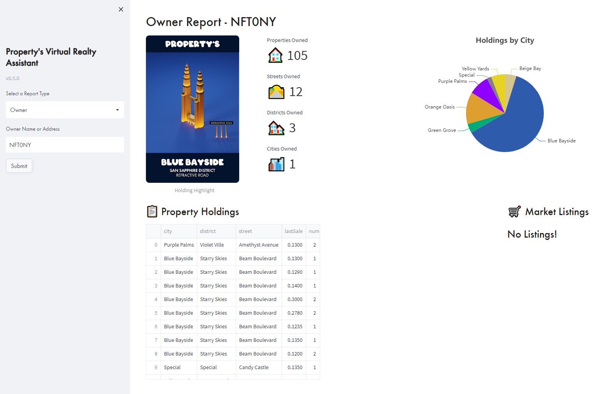

# Property's Virtual Assistant
A tool to help [Property's Virtual Realty](https://propertys.xyz) NFT holders find the best deals on the NFTs they need to construct full streets, districts and cities. The more streets, districts and cities you own, the more $BRIX you earn to use in the upcoming online marketplace.

The tool can be found directly on the [propertys.xyz](https://propertys.xyz) website or accessed as a standalone app at [https://share.streamlit.io/0xbgoat/propertys-tool](https://share.streamlit.io/0xbgoat/propertys-tool)

